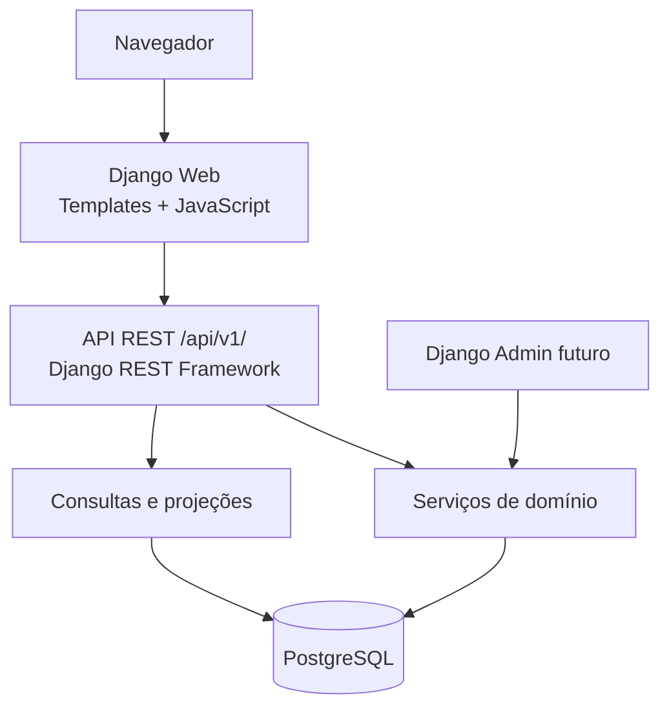

# C4 — Contêineres

## Responsabilidades

- Django Web: entrega páginas, assets e seletor de perfil.
- API: contrato versionado para operações e consultas.
- Serviços: garantem invariantes e transações.
- Projeções: calculam relatórios sem persistir totais manuais.
- PostgreSQL: fonte de verdade operacional.
- Django Admin: reservado para administração futura.
