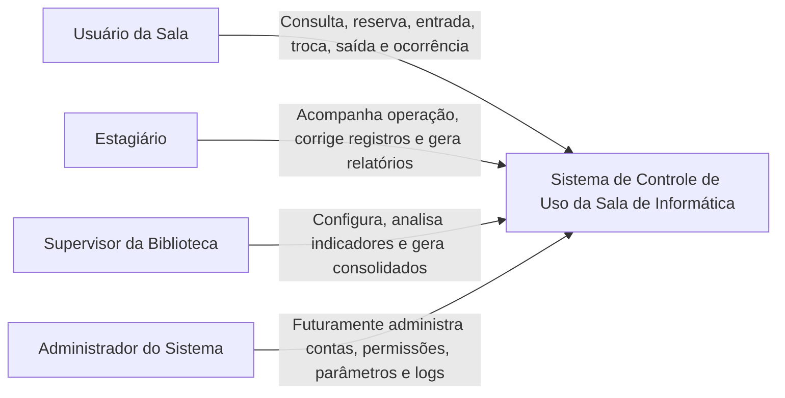

# C4 — Contexto

## Observações

- O MVP não se integra a autenticação institucional.
- A escolha de perfil é simulada dentro do próprio sistema.
- Não existe fila de espera.
- O sistema é a fonte de registro das sessões e projeções de relatório.
