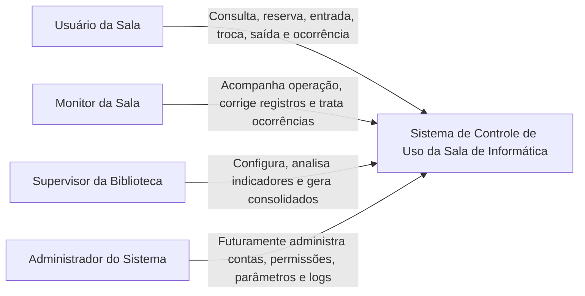

# C4 — Contexto

```mermaid
flowchart LR
    roomUser[Usuário da Sala]
    intern[Monitor da Sala]
    supervisor[Supervisor da Biblioteca]
    admin[Administrador do Sistema]
    system[Sistema de Controle de Uso da Sala de Informática]

    roomUser -->|Consulta, reserva, entrada, troca, saída e ocorrência| system
    intern -->|Acompanha operação, corrige registros e trata ocorrências| system
    supervisor -->|Configura, analisa indicadores e gera consolidados| system
    admin -->|Futuramente administra contas, permissões, parâmetros e logs| system
```

## Observações

- O MVP não se integra a autenticação institucional.
- O login local autentica contas por sessão; a aplicação ainda não se integra à identidade institucional.
- Não existe fila de espera.
- O sistema é a fonte de registro das sessões e projeções de relatório.
