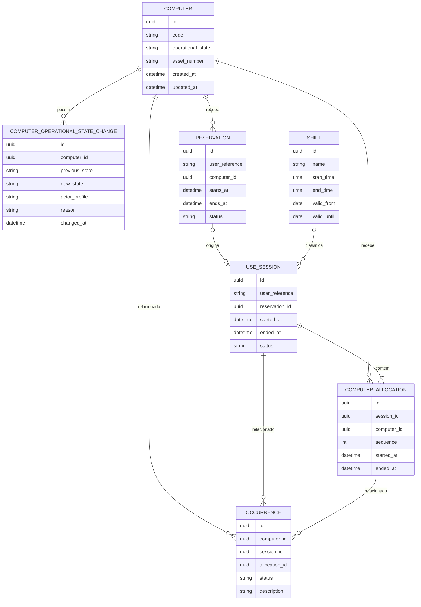

# Modelo entidade-relacionamento inicial

```mermaid
erDiagram
    COMPUTER ||--o{ COMPUTER_OPERATIONAL_STATE_CHANGE : possui
    COMPUTER ||--o{ RESERVATION : recebe
    COMPUTER ||--o{ COMPUTER_ALLOCATION : recebe
    COMPUTER ||--o{ OCCURRENCE : relacionado
    RESERVATION o|--o| USE_SESSION : origina
    USE_SESSION ||--|{ COMPUTER_ALLOCATION : contem
    USE_SESSION ||--o{ OCCURRENCE : relacionado
    COMPUTER_ALLOCATION ||--o{ OCCURRENCE : relacionado
    SHIFT o|--o{ USE_SESSION : classifica

    COMPUTER {
        uuid id
        string code
        string operational_state
        string asset_number
        datetime created_at
        datetime updated_at
    }

    COMPUTER_OPERATIONAL_STATE_CHANGE {
        uuid id
        uuid computer_id
        string previous_state
        string new_state
        string actor_profile
        string reason
        datetime changed_at
    }

    RESERVATION {
        uuid id
        string user_reference
        uuid computer_id
        datetime starts_at
        datetime ends_at
        string status
    }

    USE_SESSION {
        uuid id
        string user_reference
        uuid reservation_id
        datetime started_at
        datetime ended_at
        string status
    }

    COMPUTER_ALLOCATION {
        uuid id
        uuid session_id
        uuid computer_id
        int sequence
        datetime started_at
        datetime ended_at
    }

    OCCURRENCE {
        uuid id
        uuid computer_id
        uuid session_id
        uuid allocation_id
        string status
        string description
    }

    SHIFT {
        uuid id
        string name
        time start_time
        time end_time
        date valid_from
        date valid_until
    }
```

O diagrama é conceitual. Constraints, índices e tipos definitivos serão registrados nas migrations e atualizados neste documento.
