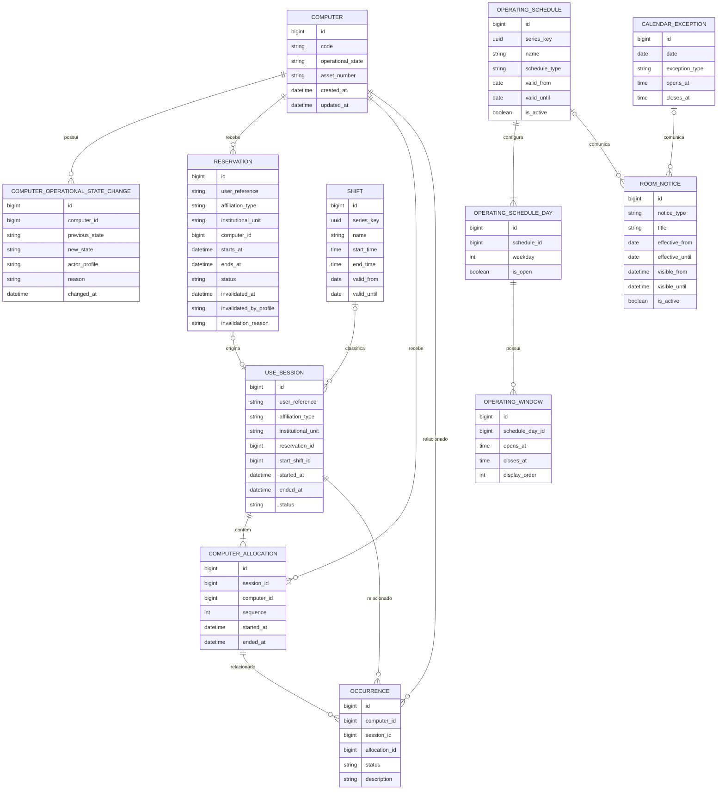

# Modelo entidade-relacionamento

O diagrama é conceitual. Migrations registram constraints e índices definitivos, inclusive não sobreposição de calendários ativos do mesmo tipo, unicidade de dia por calendário e abertura anterior ao fechamento.
