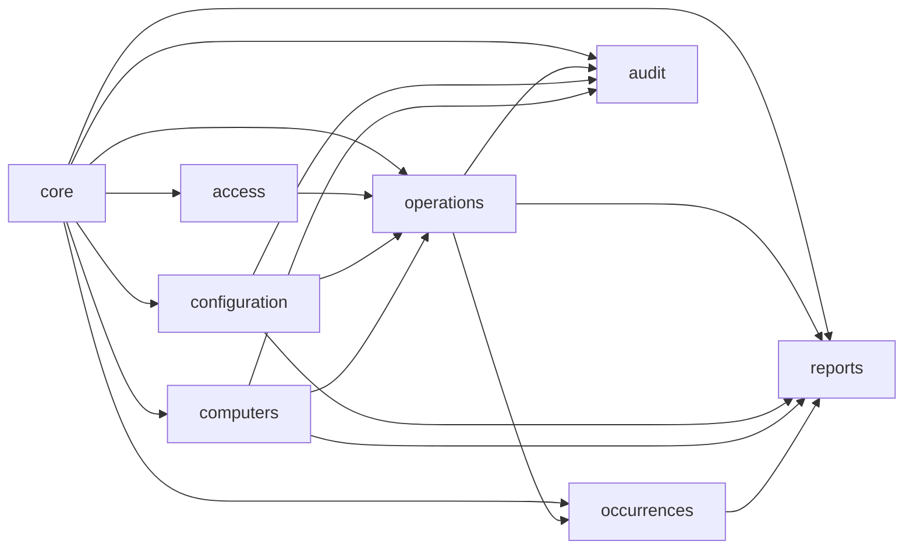

# Mapa de módulos

## Regra de direção

`reports` pode consultar os outros domínios, mas os domínios operacionais não dependem de `reports`. `core` contém apenas elementos compartilhados e não deve se tornar um app genérico para qualquer regra.
